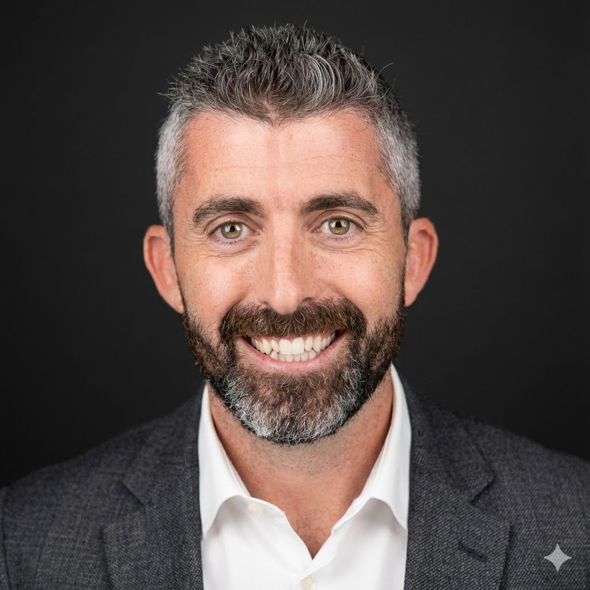

<h1 style="margin-bottom:10px;">Andrea Capasso</h1>

Research Scientist PI

2D Materials • Membranes • Nanofluidics • Advanced Devices

<h2 style="text-align:left; margin-top:10px;">Research Focus</h2>

Graphene and MXene membranes, ion transport, nanofluidics, surface-charge engineering, GFET sensing platforms, and memristive modelling of DG–CA3 circuits.

<h2 style="text-align:left; margin-top:10px;">Education</h2>

**PhD**, Materials Science and Engineering  
Institution / Years  

**MSc**, Physics or Materials Science  
Institution / Years  

<h2 style="text-align:left; margin-top:10px;">Professional Experience</h2>

  
Jan 2026 – present

  
Editorial Board Member, Diamond and Related Materials (Elsevier)

  
June 2025 – present

  
Co-Lead, Working Group 4 (Electronics), IAM-I

  
June 2025 – present

  
Head of Laboratory "2D Crystal Fab", INL – Braga, Portugal

  
Jan 2025 – present

  
Coordinator, INL Transversal Line on Advanced Materials

  
Oct 2024 – present

  
Guest Lecturer, MSc "Nanodevices and Nanoelectronics", University of Minho

  
July 2024 – present

  
Tenured Research Scientist – Principal Investigator, INL – Braga, Portugal

  
Nov 2020 – July 2024

  
Staff Researcher – Principal Investigator (GEMIS Project), INL – Braga, Portugal

  
Nov 2018 – Nov 2020

  
Marie Curie Research Fellow, INL – Braga, Portugal (2D Materials and Devices)

  
Mar 2018 – Nov 2018

  
Research Scientist, Yonsei University – Seoul, Korea

  
Oct 2014 – Dec 2017

  
Researcher, Italian Institute of Technology – Genoa, Italy (Graphene Labs)

  
May 2013 – Dec 2014

  
Research Fellow, ENEA Casaccia Research Centre – Rome, Italy

  
July 2011 – Oct 2012

  
Postdoctoral Research Fellow, Queensland University of Technology – Brisbane, Australia

  
Mar 2010 – July 2011

  
Research Assistant, Queensland University of Technology – Brisbane, Australia

  
Feb 2010 – Mar 2011

  
Sessional Academic, Queensland University of Technology – Brisbane, Australia

<h2 style="text-align:left; margin-top:10px;">Selected Publications</h2>

Graphene membrane nanochannels for tunable ion sieving (in prep.)   
Cyrene-processed MXene membranes for selective ion transport (in prep.)  
CMSMs for CO₂ separation at elevated T/p (2023)   
CO₂-selective CMS membranes from resorcinol–formaldehyde precursors (2022)   
Hydrophilic CMS membranes for bioethanol dehydration (2022)   

<h2 style="text-align:left; margin-top:10px;">Contacts</h2>

<a href="mailto:andrea.capasso@inl.int">
  andrea.capasso@inl.int
</a> 
<a href="https://scholar.google.com/citations?user=lSos5ssAAAAJ&hl=pt-PT&oi=ao" target="_blank">
  Google Scholar
</a> 
<a href="https://orcid.org/0000-0003-0299-6764" target="_blank">
  Orcid
</a> 
<a href="https://inl.int/community/andrea-capasso/" target="_blank">
  INL Page
</a>

