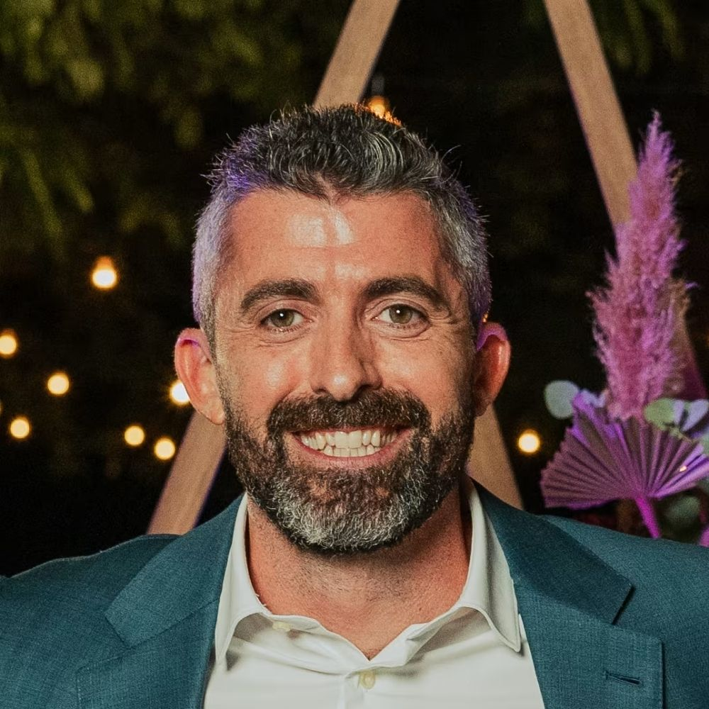
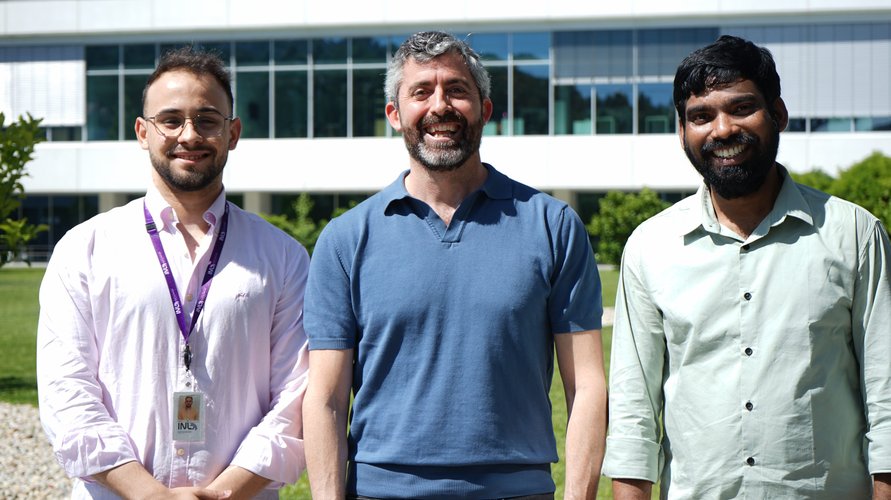

<h1 style="text-align:center; margin-top:40px;">News</h1>

  <!-- NOTÍCIA 1 -->
  

    
  <!-- Texto -->
  

    <a href="https://inl.int/inl-pi-co-leads-electronics-working-group-in-iam-i/" target="_blank">
  Dr. Andrea Capasso Appointed Co-Lead of IAM-I Electronics Working Group
    </a>
      

        Dr. Andrea Capasso has been appointed co-leader of Working Group 4 – Electronics within the Innovative Advanced Materials Initiative (IAM-I), a major European network focused on advancing innovative materials. In this role, he will help define priorities for next-generation electronic materials, such as semiconductors, flexible devices and quantum components, while fostering collaboration between research, industry, and policy to strengthen Europe’s competitiveness.
      

      

        August 13, 2025
      

    

    <!-- Imagem -->
<!-- Imagem -->

  

  <!-- NOTÍCIA 2 -->
  

    
    <!-- Texto -->
  

      <h2>Vicente Lopes wins SiNANO Institute Best Paper Award</h2>
      

        Vicente Lopes won the SiNANO Institute Androula Nassiopoulou Best Paper Award 2025 for his work on graphene-based glucose sensing in contact lenses, enabling non-invasive tear monitoring. The collaborative study, involving multiple INL researchers, will be honored at the 2026 EUROSOI-ULIS Conference in Granada, Spain. 
      

      

        September 8, 2025
      

    

    <!-- Imagem -->
  

      
    

  

   <!-- NOTÍCIA 3 -->
  

    
    <!-- Texto -->
  

      <h2>New sustainable graphene production developed at INL</h2>
      

       Capasso's group at INL have developed a sustainable method to produce graphene using water-based techniques to create highly concentrated graphene dispersions without toxic solvents. The resulting eco-friendly composite paste was used to manufacture fully flexible microsupercapacitors with exceptional energy density, coulombic efficiency, and durability, maintaining ~99% performance after 10,000 charge cycles. This breakthrough addresses longstanding toxicity and scalability barriers in graphene production, opening new possibilities for wearable electronics, IoT devices, and flexible energy storage.
      

      

        May 24, 2024
      

    

    <!-- Imagem -->
  

      
    

  

