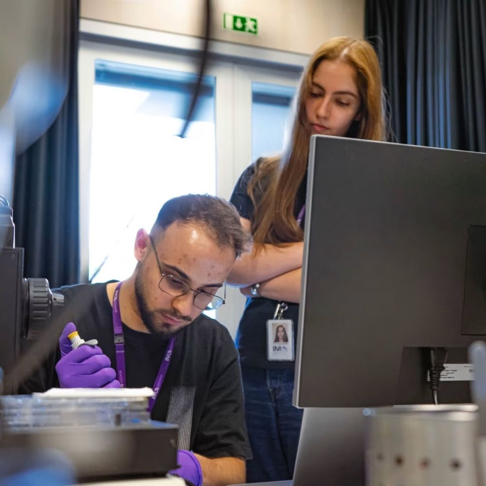

<h1 style="text-align:center; margin-top:40px;">News</h1>

  <!-- NOTÍCIA 1 -->
  

    
  

      <h2>Dr. Andrea Capasso Appointed Co-Lead of IAM-I Electronics Working Group</h2>
      

        (texto aqui...)
      

      

        Andrea Capasso — August 13, 2025
      

    

  

      
    

  

  <!-- NOTÍCIA 2 -->
  

    
  

      <h2>Vicente Lopes wins SiNANO Institute Best Paper Award</h2>
      

      

        Vicente Lopes won the SiNANO Institute Androula Nassiopoulou Best Paper Award 2025 for his work on graphene-based glucose sensing in contact lenses, enabling non-invasive tear monitoring. The collaborative study, involving multiple INL researchers, will be honored at the 2026 EUROSOI-ULIS Conference in Granada, Spain. 
      

      

      

        Andrea Capasso — September 8, 2025
      

    

  

      
    

  

