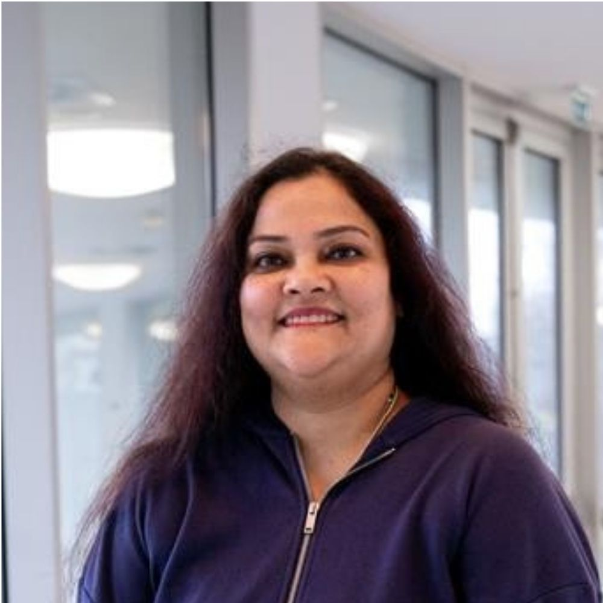

<h1 style="text-align: center;margin-top:40px;">People</h1>

<h2 style="text-align: center;">Post-Doc</h2>
 

  

    
    <h4><b>Sushmitha Veeralingam</b></h4>
    
Application & Systems Integration Engineer

    
2D Materials Fabrication

  

  

    
    <h4><b>Shusmitha Kyatam</b></h4>
    
Application & Systems Integration Engineer

    
2D Materials Fabrication

  

  

    
    <h4><b>Lisa Buttò</b></h4>
    
Research Assistant

    
2D Materials Fabrication

  

 
<h2 style="text-align: center;">Students</h2>
 

  

    
    <h4><b>Vicente Lopes</b></h4>
    
Ph.D. Course

    
2D Materials Fabrication

  

  

    
    <h4><b>Pedro Silva</b></h4>
    
Masters Course

    
2D Materials Fabrication

  

  

    
    <h4><b>Gabriel Barbosa</b></h4>
    
Masters Course

    
2D Materials Fabrication

  

 
<h2 style="text-align: center;">Former Members</h2>
 

  

    
    <h4><b>Siva S. Nemala</b></h4>
    
Application & Systems Integration Engineer

    
2D Materials Fabrication

  

  

    
    <h4><b>Guilherme Araújo</b></h4>
    
Masters Course

    
2D Materials Fabrication

  

  

    
    <h4><b>Beatriz Silva</b></h4>
    
Masters Course

    
2D Materials Fabrication

  

  

    
    <h4>Tiago Abreu</h4>
    
Masters Course

    
2D Materials Fabrication

  

