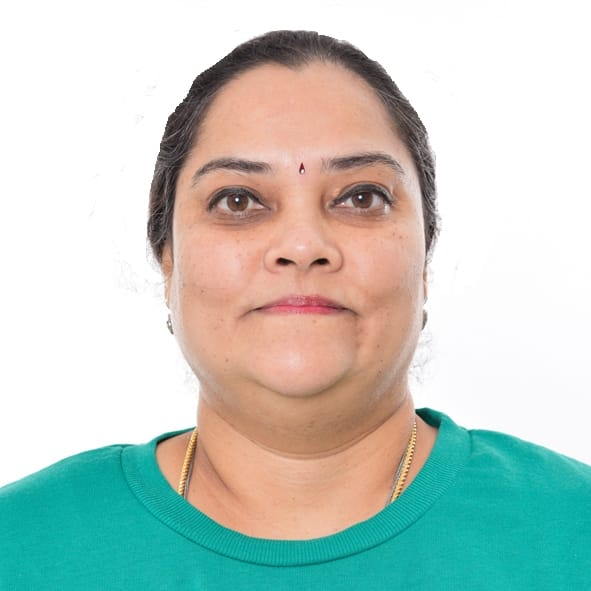

<h1 style="text-align: center;">People</h1>

 

<h2 style="text-align: center;"> Post-Doc</h2>

  

    <h4>Sushmitha Veeralingam</h4>
    
Application & Systems Integration Engineer

    
2D Materials Fabrication

    <h4>Sushmitha Veeralingam</h4>
    
Application & Systems Integration Engineer

    
2D Materials Fabrication

    <h4>Lisa Buttò</h4>
    
Application & Systems Integration Engineer

    
2D Materials Fabrication

 

<h2 style="text-align: center;"> Students</h2>

  

    <h4>Vicente Lopes</h4>
    
Ph.D.Course

    
2D Materials Fabrication

    <h4>Pedro Silva</h4>
    
Masters Course

    
2D Materials Fabrication

    <h4>Gabriel Barbosa</h4>
    
Masters Course

    
2D Materials Fabrication

 

<h2 style="text-align: center;"> Former members</h2>

  

    <h4>Siva S. Nemala</h4>
    
Application & Systems Integration Engineer

    
2D Materials Fabrication

    <h4>Guilherme Araújo</h4>
    
Masters Course

    
2D Materials Fabrication

    <h4>Beatriz Silva</h4>
    
Masters Course

    
2D Materials Fabrication

    <h4>Tiago Abreu</h4>
    
Masters Course

    
2D Materials Fabrication

  <!-- Membro 1 -->
 <!-- 

    
    <h4>Sushmitha Veeralingam</h4>
    
Application & Systems Integration Engineer

    
2D Materials Fabrication

    
Email: sushmitha.veeralingam@inl.int

  

  <!-- Membro 2 -->
  <!--

    
    <h4>Shusmitha Kyatam</h4>
    
Application & Systems Integration Engineer

    
2D Materials

    
Email: shusmitha.kyatam@inl.int

  

  

    
    <h4>Lisa Buttò</h4>
    
Application & Systems Integration Engineer

    
2D Materials

    
Email: shusmitha.kyatam@inl.int

  

  <!-- Graduate members -->
  <!--

    
    <h4>Vicente Lopes</h4>
    
Ph.D. Course

    
2D Materials and Devices

    
Email: vicente.lopes@inl.int

  

  

    
    <h4>Beatriz Silva</h4>
    
Master Course

    
2D Materials

  

  

    
    <h4>Pedro Silva</h4>
    
Master Course

    
2D Materials

    
Email: pedro.d.silva@inl.int

  

  

   
    <h4>Gabriel Barbosa</h4>
    
Master Course

    
2D Materials and Devices

    
Email: gabriel.barbosa@inl.int

  

 

<h2 style="text-align: center;">Former members</h2>

  

    
    <h4>Siva S. Nemala</h4>
    
Application & Systems Integration Engineer

    
2D Materials

    
Email: siva.sankar@inl.int

  

  

    
    <h4>Guilherme Araújo</h4>
    
Master Course

    
2D Materials Growth

    
Email: guilherme.araujo@inl.int

  

  

    
    <h4>Tiago Abreu</h4>
    
Master Course

    
2D Materials

  

 -->
