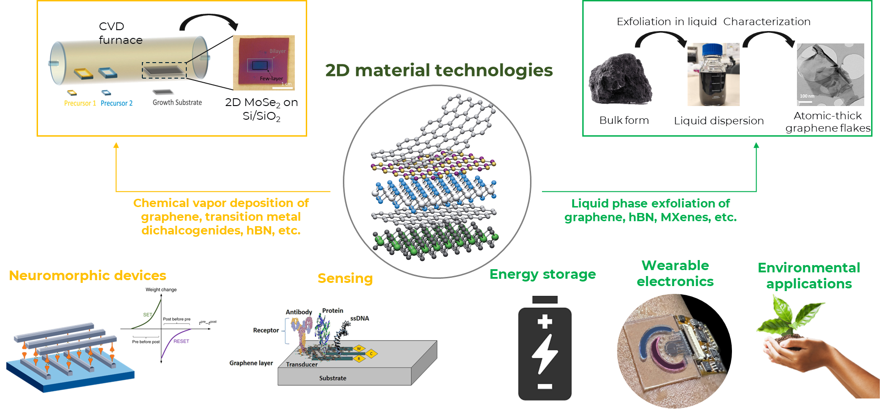
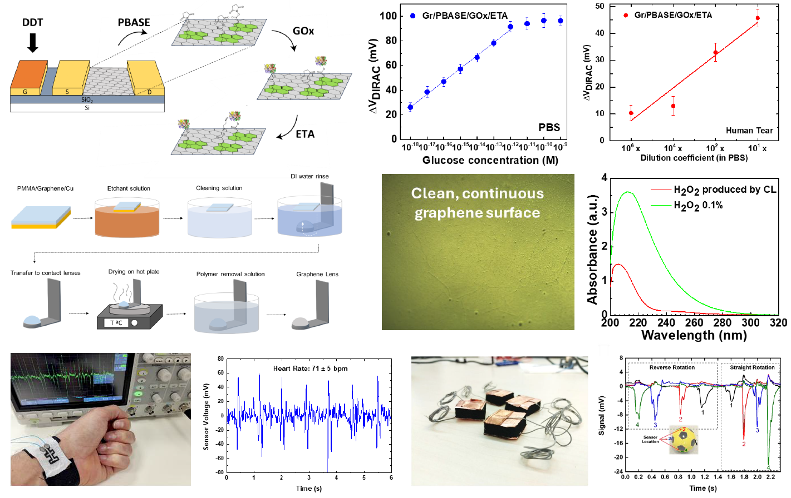
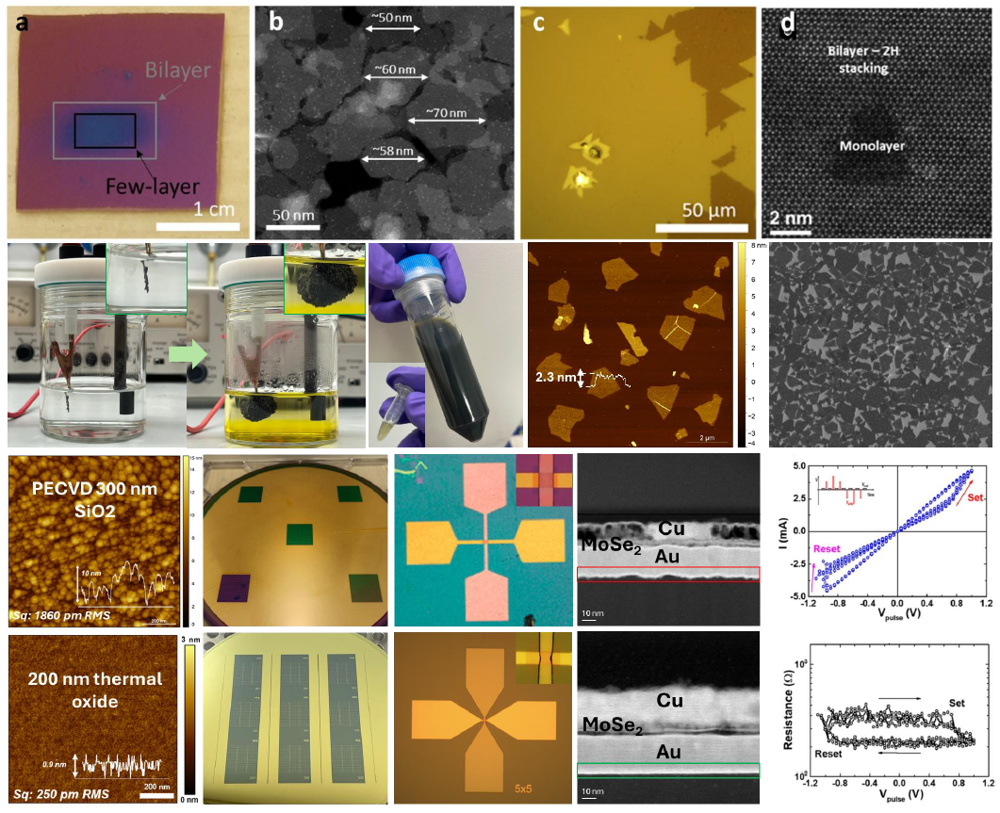

<h1 style="text-align:center; margin-top:40px;">Research</h1>

Our group works across the full stack of two-dimensional (2D) materials: from scalable production of crystals and inks, to ion-selective membranes, neuromorphic devices, and sensing platforms. We focus on mechanisms — interlayer spacing, surface charge, ion mobility, and defect engineering — and use them to design technologies for water, energy, and information processing.

<h2>2D crystal production</h2>

We develop complementary routes to produce 2D materials in forms compatible with both electronic devices and membrane technologies. On the thin-film side, we use chemical vapor deposition (CVD) and are preparing metal–organic CVD (MOCVD) processes to grow wafer-scale 2D crystals and heterostructures with controlled thickness, grain structure, and doping. These films feed directly into our work on graphene-based transistors, memristors, and hybrid interfaces.

In parallel, we employ liquid-phase exfoliation (LPE) to generate inks and laminates of graphene, MXenes, and related 2D materials. By controlling flake size, thickness, and defect density, we can tune percolation pathways, mechanical robustness, and transport properties in membranes and printed devices. A key emphasis is on green solvents and surfactants that allow scalable, environmentally responsible processing.

<h2>Nanofiltration membranes and blue energy</h2>

We design nanofiltration membranes based on stacked graphene and MXene flakes, where ion transport is governed by sub-nanometre interlayer spacing and surface charge. By engineering flake morphology, functional groups, and support choice, we target high water permeance, sharp ion sieving, and resistance to fouling for desalination and water purification.

The same membranes are used as nanofluidic systems for blue energy harvesting, where salinity gradients across charged nanochannels generate electrical power. We study how interlayer spacing, charge density, and ion valence affect osmotic energy conversion, with the goal of coupling selective membranes to practical electrochemical architectures.

<h2>Sensing and bioelectronic interfaces</h2>

We develop graphene field-effect transistor (GFET) platforms and related 2D devices for chemical and biological sensing. Our work links surface chemistry, Debye screening, and device geometry to sensitivity and selectivity, enabling real-time detection of ions, biomolecules, and environmental contaminants. Our pivotal work on the ultrasenstive and selective detection of glucose at a record limit of detection paves the way for next-generation, non-invasive glucose monitoring approaches for diabetic patients. Microfluidic integration allows controlled delivery of analytes and multiplexed measurements on the same chip.

Beyond classical sensing, we explore hybrid interfaces where 2D materials couple ionic signals in liquids to electronic readout. This includes soft, conformable substrates and printed interconnects, with an eye towards wearable and implantable systems. We emphasise device architectures that are compatible with scalable fabrication and robust long-term operation in realistic environments.

Additionally, our group focuses on strain sensing through flexible and wearable platforms based on liquid-processed 2D materials. Some examples include the fabrication of coated textiles and sponges for respiratory monitoring, rebound and rotation sensing, and radial pulse measurements.

<h2>Neuromorphic devices and hybrid memory interfaces</h2>

We work on neuromorphic hardware that combines 2D materials (i.e., transition metal dichalcogenides, hexagonal boron nitride) with memristive elements to emulate synaptic plasticity and circuit-level dynamics. Our ongoing efforts involve exploring different architectures (lateral, vertical, and heterostructures) and different 2D material production techniques (CVD, electrochemical exfoliation) to finely tune the performance metrics of the devices and to achieve reproducible technology with low device-to-device variability.

At the device level, we investigate how 2D channels, interfaces, and defects influence switching behaviour, retention, and noise in memristors and related memories. At the system level, we use these elements to implement learning rules, sequence encoding, and pattern separation that are relevant for memory processes and potential neuromorphic prostheses.

<h2>Sustainable processing and reproducibility in 2D materials</h2>

Across all projects, we focus on sustainable processing routes and reproducible protocols for 2D materials and devices. This includes the use of green solvents such as Cyrene for LPE, careful assessment of additives and dispersants, and systematic studies of artefacts in surface and structural characterisation (for example, recurrent AFM backgrounds from surfactant residues).

We are also involved in community discussions on standards, metadata, and reporting practices for 2D materials. Our goal is to move from single “hero” devices to statistically robust data, with clear links between processing history, characterisation, and performance. This approach underpins our work on membranes, electronic devices, and neuromorphic platforms, and is reflected in how we design experiments and share data.

